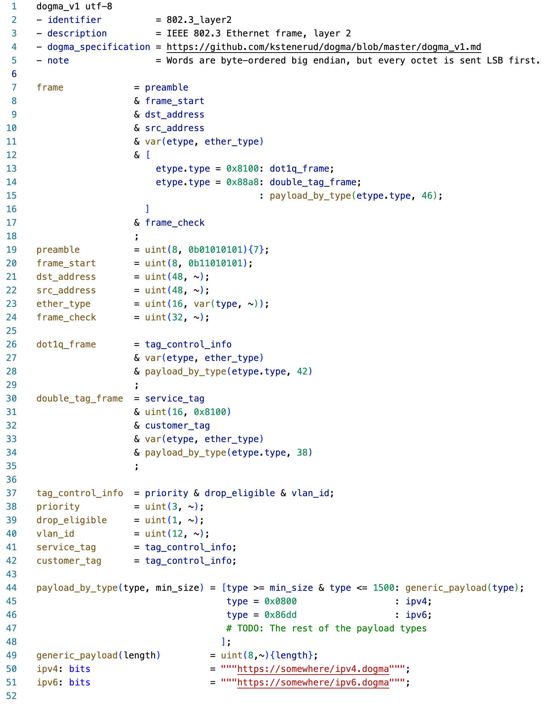

# Dogma Syntax Highlighter

Syntax highlighter for the [Dogma](https://github.com/kstenerud/dogma) metalanguage.

## About the Dogma Metalanguage

[Dogma](https://github.com/kstenerud/dogma) is a human-friendly metalanguage for describing data formats (text or binary) in documentation.

[Dogma](https://github.com/kstenerud/dogma) follows the familiar patterns of [Backus-Naur Form](https://en.wikipedia.org/wiki/Backus%E2%80%93Naur_form), with a number of innovations that make it also suitable for describing binary data.

## Screenshot

## Known Issues

TextMate syntax highlighters are limited in their power, and so it is possible to write invalid CTE code that the syntax highlighter will accept.
